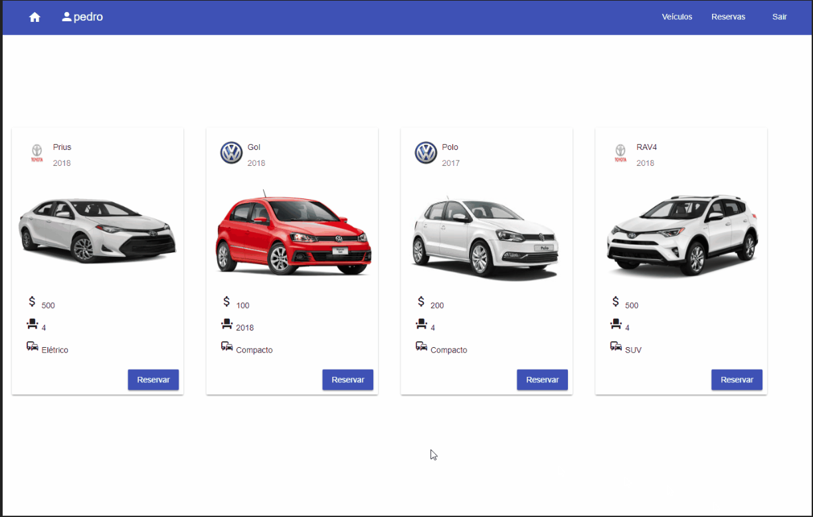

# furb-bcc

Repositório destinado ao controle de fontes desenvolvidos durante a graduação em Ciência da Computação na FURB.

Principais projetos:
- [Locadora de véiculos](programacao-III/trabalhoFinal/README.md)
    - POC de um site de reservas de veículos, backend Java (Spring) e frontend Angular 4.

