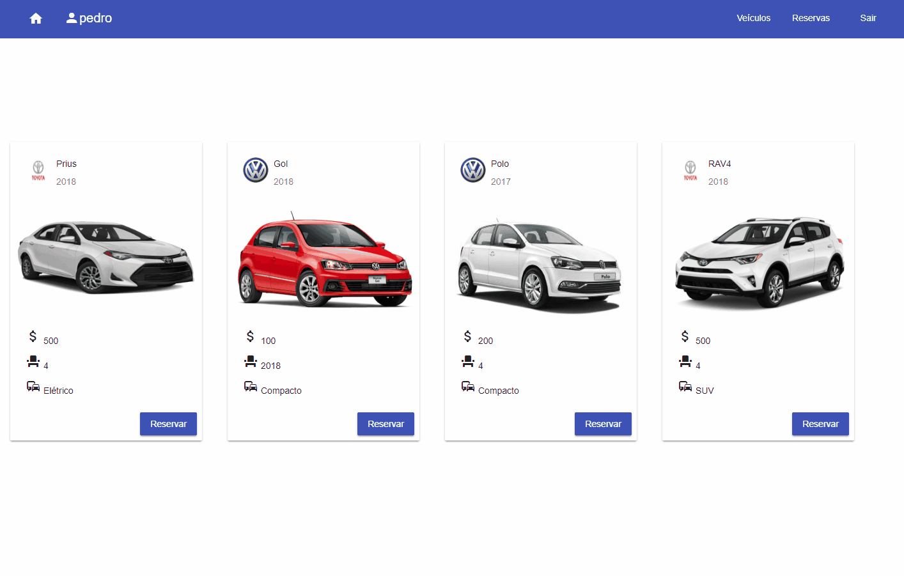
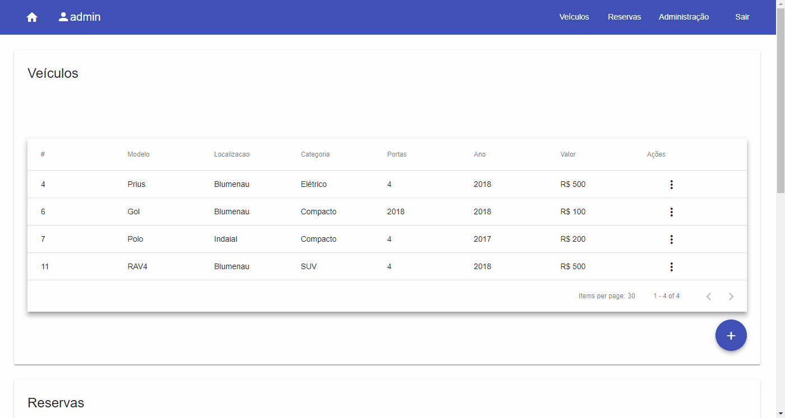

# Locadora de veículos

Aplicação desenvolvida para a matéria de Programação III - FURB - 2018/1.

Tecnologias utilizadas:

- Java - Spring Boot 2.0.1
- Angular 5

### TODO

- [ ] Spring Security (OAuth 2)
- [ ] Edit / Delete de um usuário
- [ ] Edit / Delete de uma marca
- [ ] AuthGuard - Consultar permissões no backend
- [ ] Permitir selecionar um intervalo de datas no ato da reserva

# Workflow de um usuário padrão

# Workflow de um usuário administrador

